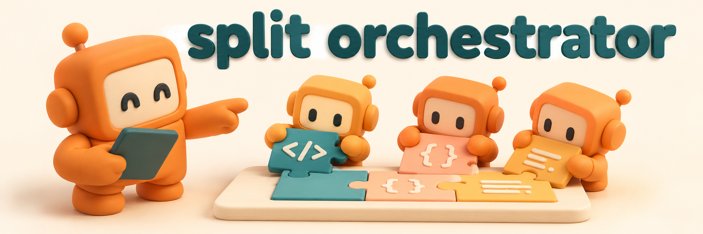
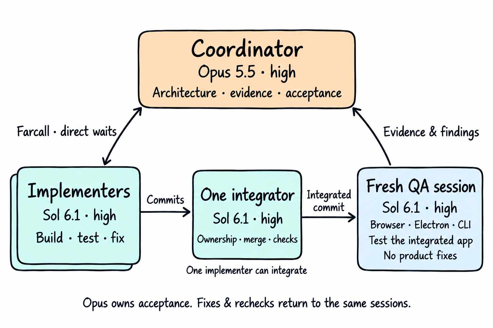

# Split Orchestrator



Opus coordinates & reviews. Sol builds, integrates & tests through [Farcall](https://github.com/regenrek/farcall-mcp).

A Claude Code plugin for clearly owned work, direct completion waits & checks against the real application. Use the fewest workers needed. One worker owns integration. A fresh Sol QA session tests the integrated app; Opus owns final acceptance.

The coordinator uses `claude-opus-5-5`, high. Workers use `gpt-6.1-sol`, high. No Astra or silent model substitutions.

## Install

Install both plugins in Claude Code. Farcall is required.

```text
/plugin marketplace add regenrek/farcall-mcp
/plugin install codex-worker@farcall
/plugin marketplace add regenrek/split-orchestrator
/plugin install split-orchestrator@split-orchestrator
```

With Node 24+ & a signed-in Codex CLI available, start a new coordinator session from your repository.

```sh
CLAUDE_CODE_MCP_AUTO_BACKGROUND_MS=0 MCP_TOOL_TIMEOUT=7200000 \
  claude --model claude-opus-5-5 --effort high
```

[Setup, browser access & upgrading from 0.1](docs/usage.md).



## Try it

```text
/split-orchestrator:orchestrate Build <feature> in <repository>.
Propose a short plan and wait for my approval.
Report what changed, what passed and what remains open.
No push, main merge, deployment or publishing without approval.
```

The skill handles ownership, isolated checkouts, worker corrections & coordinator acceptance. Add constraints or specific user journeys to the prompt. UI work requires a working browser connection in the QA session to the real application/backend.

## Why this workflow

In practical builds, Opus coordinated Sol workers through Farcall & returned corrections to their original sessions. The benchmarks also exposed shared-file conflicts, lost drafts & retries that reported success without saving changes. This workflow makes ownership & persisted outcomes explicit. It is not a claim that a model pairing guarantees quality.

[Evidence & verification limits](docs/evaluation.md).

## Docs

[Usage](docs/usage.md) · [Verification](docs/evaluation.md) · [Development](docs/development.md) · [bb](hosts/bb/README.md) · [herdr](hosts/herdr/README.md)

[MIT license](LICENSE)
